# ML-Based Fault Detection in Pulse Oximeter Sensor Data

This repository contains a Python implementation of an **unsupervised machine learning pipeline** for detecting faults in **pulse oximeter sensor data**.  
The approach uses **preprocessing, feature extraction, normalization across recordings, and anomaly detection** to flag unusual sensor behaviors.  

⚠️ **Note**: This is an **educational project**, not a clinical diagnostic tool.

---

## Overview

Pulse oximeters measure **oxygen saturation (SpO₂)** and **heart rate (HR)**. These devices are widely used in both clinical and home-care settings.  
However, faulty readings due to **motion artifacts, poor sensor contact, or environmental interference** can cause **false alarms** or **missed emergencies**.  

This project demonstrates a **machine learning-based workflow** for detecting faulty readings:

1. Load and preprocess real-world data.  
2. Handle missing values and physiologically implausible measurements.  
3. Extract features.  
4. Normalize features across all recordings.  
5. Apply **Isolation Forest** for unsupervised anomaly detection.  
6. Provide evaluation metrics (precision, recall, F1).  

---

## Dataset

I used the **[BIDMC PPG and Respiration Dataset (PhysioNet)](https://physionet.org/content/bidmc/1.0.0/)**.  

- **Subjects:** 53 ICU patients  
- **Signals (125 Hz):** PPG, impedance respiration, ECG  
- **Parameters (1 Hz):** SpO₂, HR, respiratory rate  

**Focus in this project:**  
- SpO₂ (oxygen saturation, %)  
- HR (heart rate, bpm)  

---

## Preprocessing

Steps implemented in the notebook:

- **Missing value handling** → Drop NaNs.  
- **Implausible values** → Remove SpO₂ < 50% or > 100%, HR < 20 bpm or > 220 bpm.  
- **Feature extraction** →  
  - Statistical: mean, variance  
  - Dynamic: maximum jump (sudden change), stuck value count  
- **Normalization** → Features are normalized **across all recordings** so they are on a comparable scale before anomaly detection.  

---

## Algorithm

The core ML model is an **Isolation Forest**:

- Type: Unsupervised anomaly detection  
- Goal: Learn "normal" sensor behavior and flag deviations as potential faults  
- Advantage: Works without labeled data (important for medical datasets where faults are rarely annotated)

---

## Evaluation

Since the dataset does not include ground-truth anomaly labels, 
traditional metrics such as precision, recall, and F1-score could not be computed.  

Instead, evaluation is performed using:
- **Anomaly score distributions** from the Isolation Forest model, which illustrate how well the model separates potential faults from normal readings.
- **Visualization of detected anomalies**, providing qualitative insight into where and how the model flags suspicious patterns.

⚠️ In a real-world scenario, expert-annotated labels or fault logs would be necessary to validate performance quantitatively (e.g., via precision/recall/F1).

# Anomaly Score Distribution
Histogram showing anomaly scores for recordings.
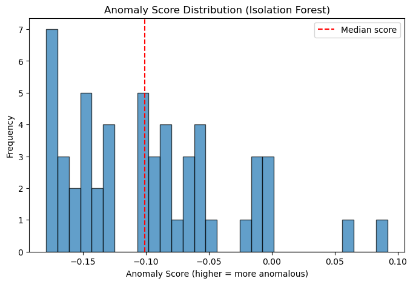

# Isolation Forest Anomaly Scores per Recording
Bar chart showing anomaly scores for recordings, showing 2 scores above 0.05 of potential faults.
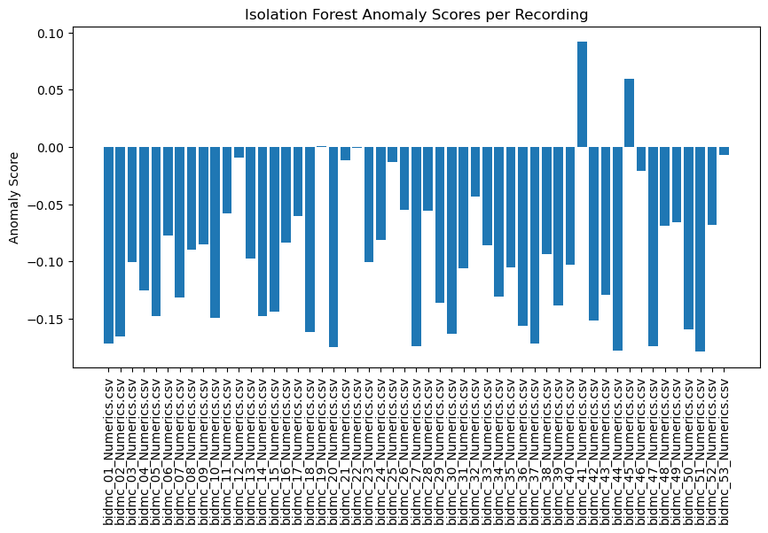

# Normal vs Faulty Recordings
Scatter plot showing anomaly scores for recordings, showing 4 true faults.
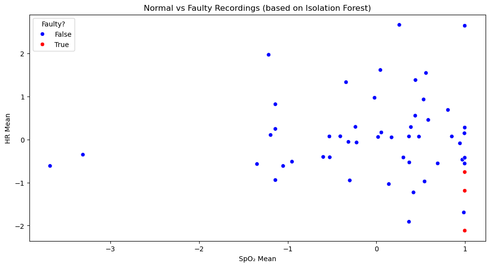

# Raw Signals
Line chart showing anomaly scores for bidmc_19_Numerics.csv, showing too much variation of HR.
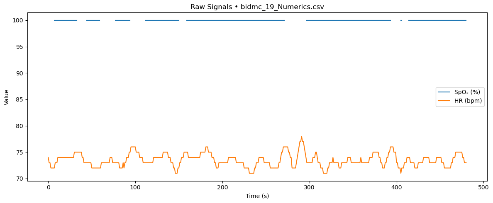

# Isolation Forest: Anomaly Scores per Recording (sorted)
Bar chart showing anomaly scores, showing 2 scores above 0.05 of potential faults.
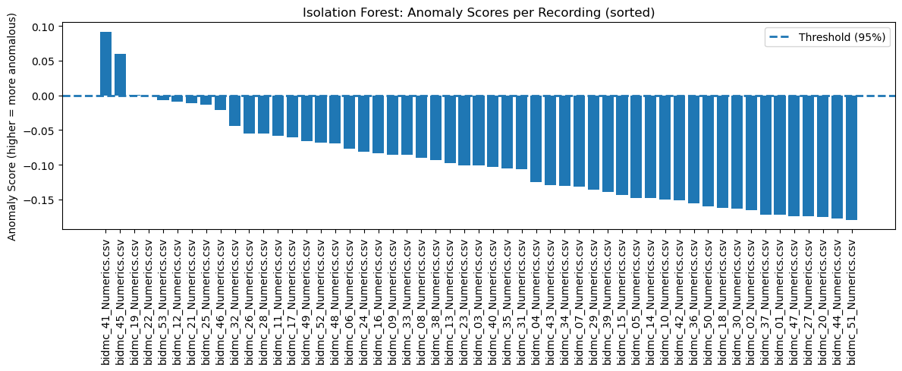

# Distribution of Anomaly Scores
Bar chart showing anomaly scores, showing 2 scores above 0.05 of potential faults.
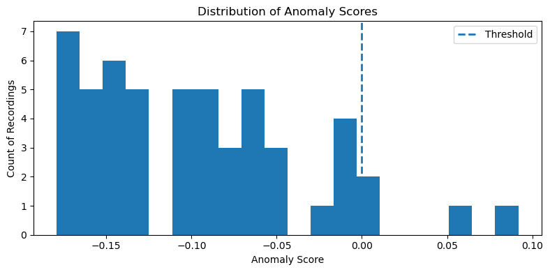

# SpO2 Mean vs HR Mean
Scatter plot showing anomaly scores, showing 4 true faults with distinct deviations in SpO2 and HR means.
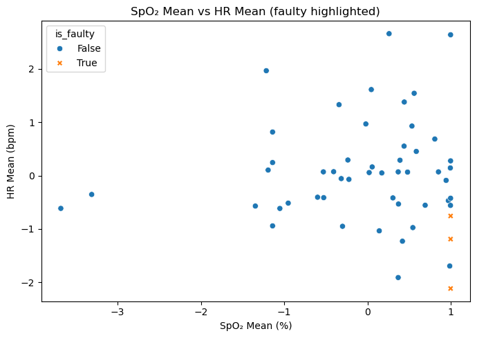

# Feature Distributions by Fault Status
Box plot showing anomaly scores, highlighting 8 key features with distinct distributions between faulty and normal recordings.
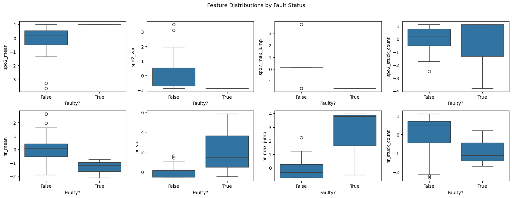

# Correlation Heatmap
Heatmap, highlighting strong correlations (e.g., 0.8) between hr_var and hr_max_jump, indicating potential dependencies among features.
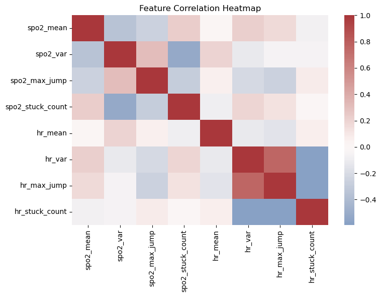

# Raw Signals
Line chart for bidmc_41_Numerics.csv, showing too much variation of HR with a significant drop below 60 bpm.
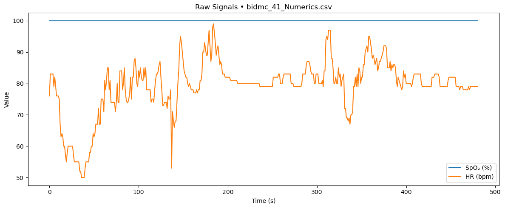

# Raw Signals
Line chart for bidmc_45_Numerics.csv
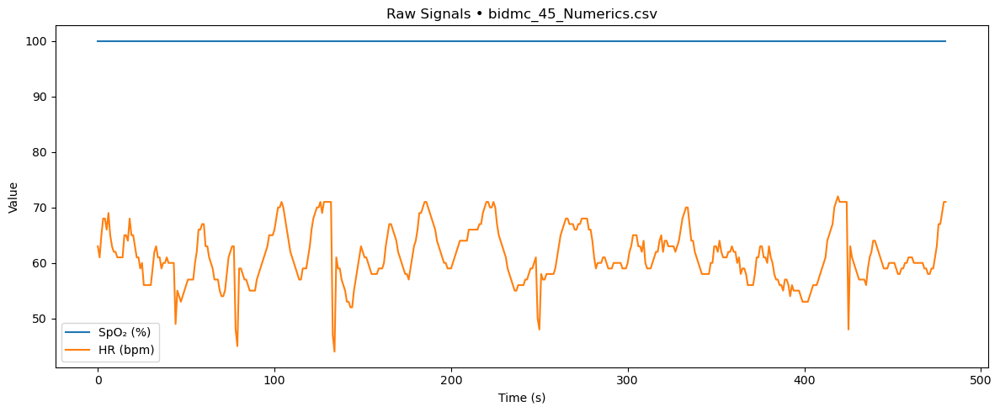

## Note

This project is for educational purposes only.
It is not intended for clinical decision-making.
